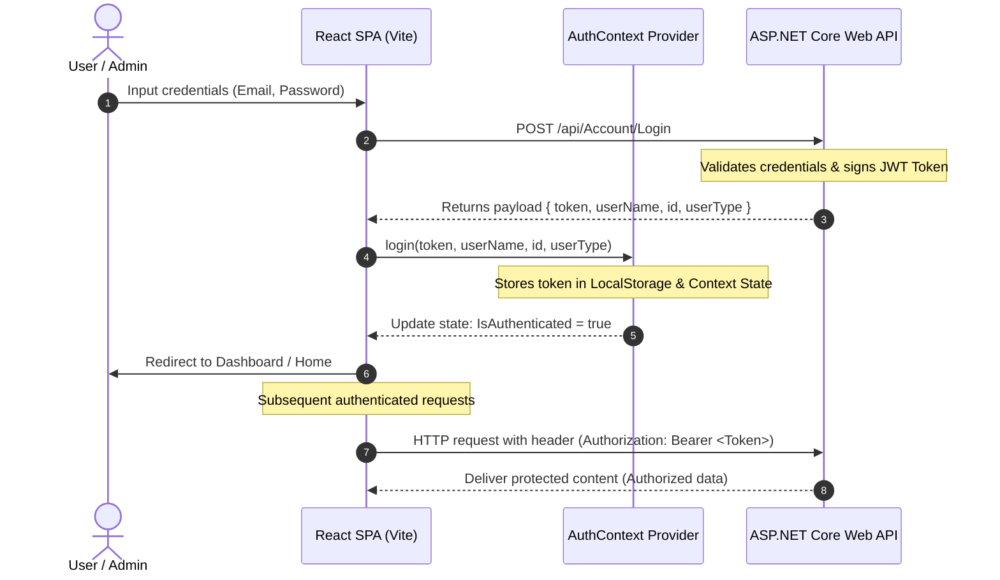

<!--
  AL WAFA TRADING - GitHub README Configuration
  Optimized for Desktop & Mobile views with a highly clean, premium layout.
-->

<div align="center">
  
  
  # 🧱 Al Wafa Trading Platform

[](https://react.dev/)
[](https://vite.dev/)
[](https://tailwindcss.com/)
[](https://www.framer.com/motion/)
[](https://vercel.com/)
[](https://opensource.org/licenses/MIT)

**A Premium E-Commerce Catalog, B2B Procurement, and Dashboard Management System**

---

[🌐 Live Demo Platform](#-demo--preview) • [⚙️ Installation Steps](#-installation) • [📋 API Endpoints](#-api-endpoints) • [🔑 Auth Flow](#-authentication-flow) • [📬 Contact Support](#-contact-information)

</div>

---

## 📖 Short Description

**Al Wafa Trading** is an award-winning level digital storefront, B2B materials catalog, and back-office administration system built for **Al Wafa**, a highly prestigious family-owned timber and building materials supplier founded in **Doha, Qatar in 1959** under the partnership of Mr. Ahmed Abbas and Mr. Khalid Bin Ahmed Al Sowaidi (Chairman of Qatar Islamic Bank).

This modern platform serves the trade and construction ecosystem by allowing clients to browse high-quality structural materials (e.g., timbers, panels, paint products) sourced globally. Users can filter materials through precise physical dimensions (width, length, thickness), maintain a dynamic shopping cart, and submit structural orders. Orders are bridged into a **WhatsApp procurement channel** for custom tailoring. Concurrently, a powerful **Admin Control Panel** enables real-time sales performance review, product management, service customization, and customer request fulfillment.

---

## 🌐 Demo / Preview

To experience the platform's user-facing catalog or test the comprehensive administration control center, visit the live deployment environment:

- **Live Demo URL:** `https://alwafa-trading.vercel.app` _(Placeholder - replace with actual URL if different)_
- **Customer Sandbox Login:**
  - **Email:** `client@alwafa.com.qa`
  - **Password:** `Client@1234`
- **Administrator Sandbox Login:**
  - **Email:** `admin@alwafa.com.qa`
  - **Password:** `Admin@1234`

---

## 📸 Screenshots Section

Below is a breakdown of the primary interfaces showing the premium aesthetic and layout:

|                                                                             🏠 Customer Landing & Hero                                                                             |                                                                              🛒 Shop Catalog & Dynamic Sidebar                                                                              |
| :--------------------------------------------------------------------------------------------------------------------------------------------------------------------------------: | :-----------------------------------------------------------------------------------------------------------------------------------------------------------------------------------------: |
|  <br/> _Dynamic landing page showing craftsmanship heritage._ |  <br/> _Searchable catalog listing dimension specific panels._ |

|                                                                                   📊 Administrator KPI Dashboard                                                                                   |                                                                                       📦 Order Inquiries Control                                                                                        |
| :------------------------------------------------------------------------------------------------------------------------------------------------------------------------------------------------: | :-----------------------------------------------------------------------------------------------------------------------------------------------------------------------------------------------------: |
|  <br/> _Global dashboard displaying total products, sales, and accounts._ |  <br/> _Cart logs waiting for approval, cancellation, and validation._ |

---

## ✨ Features

### 👤 Customer-Facing Storefront

- **Dynamic Services Categories**: Multi-tiered catalog organizing timbers, hardware, paints, and raw materials into structured tabs.
- **Granular Dimension Filtering**: Filter products dynamically based on complex trade measurements including **Width**, **Length**, and **Thickness**.
- **Seamless Local Cart Store**: State persistent React Context Cart allowing product accumulation, quantity adjustments, and auto-syncing.
- **Direct B2B WhatsApp Bridging**: Generates structured orders and launches a pre-filled trade inquiry directly to the Al Wafa WhatsApp desk (`+974 6623 0548`).
- **Interactive Inbox Feedback**: A direct messaging pipeline to submit corporate inquiries right from the Contact Section to the administrators.

### 🛡️ Administrator Operations Portal

- **KPI Metrics Overview**: Comprehensive data cards displaying cumulative product counts, user growth, administrative accounts, and sales volumes.
- **Complete Product CRUD**: Dynamic visual forms with image upload bindings to create, edit, update, or delete catalog items.
- **Orders Verification pipeline**: Monitor, confirm, or cancel customer cart reservations in real time.
- **Secure Access Protection**: Custom route security blocks (`PrivateRoute`) preventing unauthorized dashboard URL navigation.
- **User Management Dashboard**: Listing and oversight of registered consumers and personnel permissions.

---

## 🛠️ Tech Stack

### Frontend Architecture

- **Library / Framework**: [React 19](https://react.dev/) (Single Page Application design patterns)
- **Build Engine**: [Vite 6](https://vite.dev/) (Instant HMR & optimized production bundling)
- **Styling & Theme**: [Tailwind CSS v3](https://tailwindcss.com/) & [PostCSS](https://postcss.org/) for a rich fluid layout
- **Motion Library**: [Framer Motion 12](https://www.framer.com/motion/) providing micro-interactions and transitions
- **Routing System**: [React Router DOM v6](https://reactrouter.com/) (Declarative page mapping)
- **Carousel Mechanics**: [Swiper 11](https://swiperjs.com/) for fluid visual galleries
- **Icon Bundles**: [Lucide React](https://lucide.dev/) and [React Icons (Fi/Fa)](https://react-icons.github.io/react-icons/)
- **Notifications**: [React Toastify](https://fkhadra.github.io/react-toastify/) & [React Hot Toast](https://react-hot-toast.com/)

### Backend Connection & Hosting

- **API Framework**: ASP.NET Core Web API (Secure token-based architecture)
- **Hosted Endpoint**: `https://elwafastore.premiumasp.net/api/`
- **Authentication**: JSON Web Tokens (JWT Bearer Tokenization)
- **Hosting Platform**: **Vercel** with full client-side redirection rules (`vercel.json`)

---

## ⚙️ Installation

Make sure you have [Node.js](https://nodejs.org/) (v18.0.0 or higher) and [npm](https://www.npmjs.com/) installed on your machine.

### 1. Clone the Repository

```bash
git clone https://github.com/your-username/alwafa_trading.git
cd alwafa_trading
```

### 2. Install Dependencies

Execute the setup command to install the required packages:

```bash
npm install
```

---

## 🔑 Environment Variables

The codebase is currently configured with a centralized production endpoint (`https://elwafastore.premiumasp.net/api/`). To configure local environments, it is recommended to introduce standard env variables.

Create a `.env` file in the root folder:

```env
# Production API endpoint URL
VITE_API_BASE_URL=https://elwafastore.premiumasp.net/api/

# Optional Local Environment API
# VITE_API_BASE_URL=http://localhost:5000/api/
```

> [!TIP]
> Ensure all endpoints fetched in `src/pages/` and `src/components/` refer to `import.meta.env.VITE_API_BASE_URL` to facilitate switching between staging and production seamlessly!

---

## 🚀 Running the Project

### Development Server

Run the local development server with Hot Module Replacement (HMR):

```bash
npm run dev
```

Once started, navigate to `http://localhost:5173` in your browser.

### Production Build

Compile and bundle optimal assets for deployment:

```bash
npm run build
```

The compiled files will be output to the `/dist` directory.

### Preview Build

Test the production-ready build locally:

```bash
npm run preview
```

### Linting

Check files for code styling and syntax guidelines:

```bash
npm run lint
```

---

## 📁 Folder Structure

Here is the directory structure showing the clean separation of concerns and role-based views:

```text
alwafa_trading/
├── public/                 # Static assets served directly (icons, manifest)
├── src/
│   ├── assets/             # Brand logos, decorative backgrounds, and visual placeholders
│   ├── components/         # Reusable global elements & page section cards
│   │   ├── Navbar.jsx      # Header navigation menus (public)
│   │   ├── Navbar2.jsx     # Alternate navigation layouts
│   │   ├── Footer.jsx      # Global footer containing company context
│   │   ├── AddToCartButton.jsx # Modular cart API integration action
│   │   └── PrivateRoute.jsx # Authentication route protection wrapper
│   ├── context/            # React Context Providers for global systems
│   │   ├── AuthContext.jsx # JWT management, user claims, and login session
│   │   ├── CartContext.jsx # Shopping list items aggregation & localStorage sync
│   │   └── ResetCodeContext.jsx # Recovery flow code validations
│   ├── layouts/            # Page templates defining grid layouts
│   │   ├── MainLayout.jsx  # Customer view container (Header + Children + Footer)
│   │   └── AdminLayout.jsx # Dashboard wrapper with a dynamic sidebar navigation
│   ├── pages/              # Screen components
│   │   ├── Site/           # Customer pages (Home, Shop, Cart, Account Recovery)
│   │   └── Admin/          # Control Panel views (Dashboard, Products, Orders, Users)
│   ├── routes/             # App routing and route configurations
│   │   └── routes.jsx      # Lazy-loaded page route declarations
│   ├── App.jsx             # Root React configuration
│   ├── index.css           # Global custom styles and Tailwind directives
│   └── main.jsx            # Core bootstrapper
├── eslint.config.js        # ESLint configuration
├── index.html              # Single Page Application HTML shell
├── package.json            # Scripts, dependencies, and metadata
├── postcss.config.js       # PostCSS plugins
├── tailwind.config.js      # Utility styling setup
├── vercel.json             # Vercel SPA router redirection file
└── vite.config.js          # Vite build bundler configuration
```

---

## 📋 API Endpoints

The frontend application integrates with the following ASP.NET Core API routes hosted on `https://elwafastore.premiumasp.net/api/`:

### 🔐 Authentication & Accounts

| Method | Endpoint                  | Description                                | Auth Required |
| :----: | :------------------------ | :----------------------------------------- | :-----------: |
| `POST` | `/Account/Login`          | User login verification & JWT generation.  |      ❌       |
| `POST` | `/Account/Register`       | Register new customer accounts.            |      ❌       |
| `POST` | `/Account/ForgetPassword` | Triggers a validation security token.      |      ❌       |
| `POST` | `/Account/ChangePassword` | Updates passwords using validation tokens. |      ❌       |
| `POST` | `/Account/AddAdmin`       | Registers a new Administrator account.     |   🛡️ Admin    |

### 🪵 Products & Materials

|  Method  | Endpoint           | Description                                           | Auth Required |
| :------: | :----------------- | :---------------------------------------------------- | :-----------: |
|  `GET`   | `/Product/GetAll`  | Fetch the list of all available structural materials. |      ❌       |
|  `POST`  | `/Product`         | Create a new material product in the database.        |   🛡️ Admin    |
|  `PUT`   | `/Product`         | Modify specifications (dimensions, photo, stock).     |   🛡️ Admin    |
| `DELETE` | `/Product?Id={id}` | Delete a product from the database permanently.       |   🛡️ Admin    |

### 🛠️ Services & Categories

|  Method  | Endpoint           | Description                                          | Auth Required |
| :------: | :----------------- | :--------------------------------------------------- | :-----------: |
|  `GET`   | `/Service/GetAll`  | Fetch all visual service categories (e.g., Timbers). |      ❌       |
|  `POST`  | `/Service`         | Append a new service division.                       |   🛡️ Admin    |
|  `PUT`   | `/Service`         | Modify existing category configurations.             |   🛡️ Admin    |
| `DELETE` | `/Service?Id={id}` | Delete category classification.                      |   🛡️ Admin    |

### 🛒 Shopping Cart & WhatsApp Operations

|  Method  | Endpoint                        | Description                                            | Auth Required |
| :------: | :------------------------------ | :----------------------------------------------------- | :-----------: |
|  `POST`  | `/Cart/AddToCart`               | Sync newly added cart products to the server database. |    🔑 User    |
| `DELETE` | `/Cart/RemoveFromCart`          | Deletes products from user's active database cart.     |    🔑 User    |
|  `POST`  | `/Cart/GoToWhatsApp`            | Registers intent & redirects client to WhatsApp.       |    🔑 User    |
|  `GET`   | `/Cart/GetDashBoardCarts`       | Lists user shopping cart requests.                     |   🛡️ Admin    |
|  `POST`  | `/Cart/ConfirmCart?CartId={id}` | Sets order cart status as Approved.                    |   🛡️ Admin    |
|  `POST`  | `/Cart/CancelCart?CartId={id}`  | Sets order cart status as Cancelled.                   |   🛡️ Admin    |

---

## 🔄 Authentication Flow

The security mapping follows a robust stateless execution pattern:



1. **Token Persistence**: Upon successful authentication, the JWT token is saved inside local storage via `AuthContext.jsx`.
2. **Access Guards**: Routes inside `src/routes/routes.jsx` targeting `/admin/*` are nested under `PrivateRoute.jsx`. If a valid token is not detected, redirection to `/admin/login` is triggered automatically.

---

## 🌐 Deployment

The system is configured for seamless deployment to **Vercel** as a Single Page Application (SPA).

### Vercel Redirections Configuration (`vercel.json`)

To allow React Router client-side page routing without hitting 404 errors on page reloads, a custom redirection configuration is active:

```json
{
  "rewrites": [
    {
      "source": "/(.*)",
      "destination": "/index.html"
    }
  ]
}
```

### Steps to Deploy manually via Vercel CLI:

```bash
# Install Vercel globally (if not already installed)
npm install -g vercel

# Login to Vercel and link your workspace
vercel login
vercel link

# Build and Deploy
vercel --prod
```

---

## 🔮 Future Improvements

- [ ] **Dual-Language Interface**: Complete support for English & Arabic translation sheets to match the Qatari local market demands.
- [ ] **Online Payments Bridge**: Integration of secure checkout gateways like Stripe or local Qatari banking payment systems (QPay).
- [ ] **Dynamic Stock Management**: Visual stock markers displaying remaining material counts with push alerts on depleting materials.
- [ ] **WhatsApp API Integration**: Automating automated replies and order invoices back-to-backend through official Meta WhatsApp Business API pipelines.

---

## 🤝 Contributing

Contributions are what make the open source community such an amazing place to learn, inspire, and create. Any contributions you make are **greatly appreciated**.

1. Fork the Project.
2. Create your Feature Branch (`git checkout -b feature/AmazingFeature`).
3. Commit your Changes (`git commit -m 'Add some AmazingFeature'`).
4. Push to the Branch (`git push origin feature/AmazingFeature`).
5. Open a Pull Request.

---

## 📄 License

Distributed under the MIT License. See [`LICENSE`](./LICENSE) for more information.

---

## 📬 Contact Information

- **Company Address**: Gate 96, Street 21, Industrial Area, Doha - Qatar
- **Phone Channels**: +974 4460 0849 | +974 4460 2536
- **Official Website**: [www.alwafa.com.qa](http://www.alwafa.com.qa) _(Replace if applicable)_
- **Social Media Platforms**:
  - [Facebook Page](https://www.facebook.com/share/15j2ZyRxZT/)
  - [Instagram Profile](https://www.instagram.com/alwafatrading.qa?igsh=MzRlODBiNWFlZA==)

<div align="center">
  <br/>
  <sub>© 2026 Al Wafa Trading Doha, Qatar. Sourced with premium global specifications.</sub>
</div>
"# alwafa-trading-ecommerce" 
